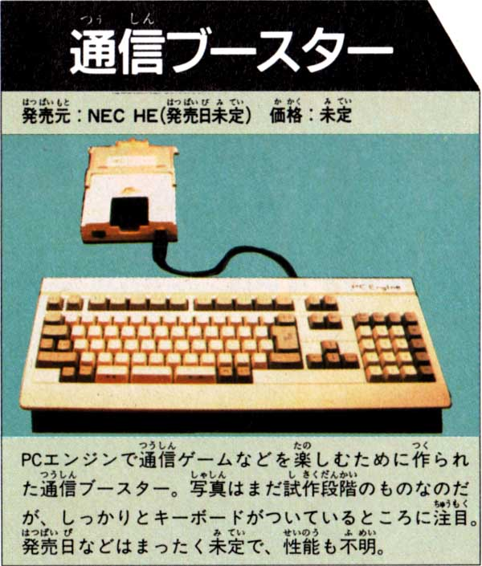
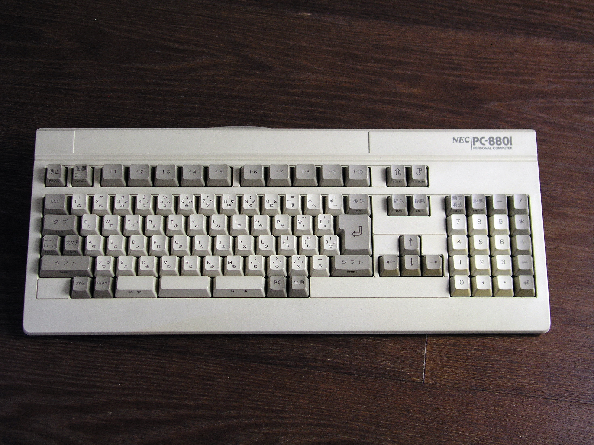

# Tsuushin Keyboard

The unreleased PC Engine keyboard

## Technical Overview

See [Technical overview here: Technical.md](Technical.md)

## History of the Tsuushin Keyboard

In 1989/1990, NEC and Hudson were working on an expansion device for the PC Engine called
the Tsuushin Booster, which would bring modem capabilities to the PC Engine. This device was
never brought to market, and was cancelled in 1990. Very few units were ever produced (as they
were only sample units or used for internal development and testing), so it is unlikely that
you would be able to locate one these days at any price.

The software component of the Tshushin Booster added several interesting capabilites besides
actual modem-based communication.  It added:
- A BASIC processor, from which users could enter programs
- A facility to load and save these to non-volatile memory
- Sprite and Character graphic editors
- Support for a keyboard device

The Keyboard device is probably even more rare than the Tsuushin Booster itself; I have
never heard any reports of seeing an actual device in person. However, we can infer a lot of
information from pictures which were published, from other computers of the era, and from
the way in which the Tsuushin Booster ROM reads (and interacts) with the (imaginary) device.

Consider this repository an example of archaeological reconstruction (of retrocomputing devices).

[More information on the Tsuushin Booster can be found here: https://www.chrismcovell.com/TsushinBooster/](https://www.chrismcovell.com/TsushinBooster/)

NOTE: Please do not ask me for the ROM; I will not share it. However, I happily share the results of my research.


### Differences in Layout from Modern Japanese Keyboards

First, I should mention that keyboards around the world have had many different and changing layouts over
the decades. Even the "standard" North American English IBM PC keyboard layout was not so standard prior
to the IBM PC becoming the most popular computer in North America. If you don't believe this, please take a
look at keyboard layouts for old typewriters or even computers like the Apple II or TRS-80 from the 1980's.
In particular, check the location of the "@" sign, quotation mark, apostrophe, and so on.

Japanese keyboards have additional keys along the bottom row (where the space bar is), in order to manage
multiple character sets.  Even these keys are not the same today as they were on, say a PC-88 keyboard in
the 1980's.

While many of the special Japanese keys still exist on a modern Japanese keyboard (such as HENKOU, KETTEI,
KANA), all of these keys have changed position and/or size/shape and/or name (for example, the "ZENKAKU"
key, for narrow or full-width characters, is no labelled "HAN/ZEN KANJI").

**MISSING** from today's keyboard, the following keys used to exist: GRPH, PC, and several keys on the numeric keypad
(',' (comma), '=', CLR and HELP). Also, STOP and COPY (to the left of the PC-88 function keys).

See the "PC-88 Similarities" section below for a picture of a PC-88 keyboard.

### Differences in Entry from Modern Japanese Keyboards

The main entry method for Japanese text today is by typing Romaji, while the keyboard is in "Japanese"
"Japanese" language mode, and being prompted with various ways that it could be written - in both kanji and kana.
This input method is switched between languages and even input methods in the Operating System by special key
sequences.  Many modern Japanese keyboards still have hiragana printed on the keys next to roman letters;
this is in order to support another, older hiragana input method.

Without going into too much detail, this older method is the one which was primarily in use at
the time of the PC-88 and Tsuushin Keyboards.  The mode would be switched by using the HENKOU,
KETTEI, ZENKAKU, and KANA keys.  It's a bit too much to describe here, but suffice it to say that
it is not the same entry method that you would be familiar with if you use modern-day Windows or
MacOS Operating Systems.

### PC-88 Layout Similarities

Based on a rare photograph from a magazine scan during its development period, the Tsuushin Booster
keyboard appears to have been based directly on a PC-88 keyboard.  This shows from not only its shape
and style, but also the number of keys and their layout.  If the picture was clear enough, it would
almost certainly show the same labels on the keys.

Photo of Tsuushin Keyboard:




Photo of PC-88 keyboard for comparison:




## Software Which Uses the Keyboard

Aside from the Tsuushin Booster, I am not aware of any software which could use the Tsuushin Keyboard as
an input device.

...However, it might be interesting to use the information presented in this repository for new software.


## Mednafen Emulation

Interestingly, Mednafen has supported this keyboard for a long time, although this feature is basically
undocumented and has some issues.

### Test ROM

The Mednafen functionality is meaningless unless you have a program which scans the keyboard
properly, as the Tsuushin Booster program does.

I have written a test ROM which will display which keys are pressed.\
[More information can be found here: TestROM.md](TestROM.md)


### How to Activate Keyboard Emulation on Mednafen

First, you need to edit the "mednafen.cfg" file, and update the following line to:
```
pce.input.port1  tsushinkb
```

This will enable the Tsuushin Keyboard code to be activated, but it also requires "Input Grabbing" to be
turned on. While the emulator is running, enable this by holding (Left Shift)+(Control), then pressing the "menu"
key.  (On my Mac keyboard, this is the "Command" key on the right side of the space bar).


### Mednafen's Implementation and Using a MacroPad

Mednafen identifies a keypress based on a list of keyboard scancodes in the mednafen.cfg file
which look like this (example shows the '0' (zero) key):
```
;pce, Port1, Tshushin Keyboard: 0
pce.input.port1.tsushinkb.0 keyboard 0x0 39
```

These are scancodes for a North American keyboard; unfortunately, the French AZERTY keyboard (and
some others) will need a slightly different set of scancodes for their keyboard layouts. It's more
confusing than it is complicated, and a headache either way.

I'm sure that readers in France already knew this... but on the bright side, this makes Mednafen
completely reconfigurable, so it can be fixed if somebody has enough patience to create better mappings.

However, there are still some problems even for "standard" North American keybords:

1. Many keyboards (such as my own) don't have enough keys to satisfy the needs of the Tsuushin Keyboard

2. There are some errors and omissions in the Mednafen configuration - some of the Tsuushin keys are
not mapped at all, and cannot be pressed.  Others (such as '^' and Yen sign) are both mapped to the same
key (in this case, '='), and a couple more are mapped to keys which are intercepted by the Operating
System, so they don't get passed through to Mednafen... so all of these problems need to be resolved as well.

3. In addition, some of the keys are mapped, but may have different names on the new keyboard, and exist
in completely different (and sometimes inconvenient) locations.

For all of these reasons, I am using a MacroPad to create some of the keystrokes.\
If you have an Adafruit MacroPad RP2040, you can do the same.  (See below)

**Note the following New Key Names:**

| Tsushin Key | PC Keyboard Key | Comment |
|:-----------:|:---------------:|---------|
| @ | ` (backtick/tilde) | * Use Macropad |
| Yen | \ (backslash) |  |
| ^ | = | * Use Macropad |
| _ (underscore) | (no key on keyboard) | * Use Macropad |
| GRPH | Scroll Lock | * Use Macropad |
| PC | F12 | * Use Macropad |
| KANA | F11 | * Use Macropad |
| HENKOU (start convert) | Right-Alt  | * Use Macropad |
| KETTEI (unconvert) | Left-Alt  | * Use Macropad |
| ZENKAKU (width) | Right-Ctrl  | * Use Macropad |
| STOP | Pause/Break |  * Use Macropad |
| COPY | Print Screen |  * Use Macropad |
| Clear | Home |  |
| HELP | END |  |
| Roll Down | Page Down |  |
| Roll Up | Page Up |  |

**In order to get this to work, you will need to update the following your mednafen.cfg:**
```
pce.input.port1.tsushinkb.grph keyboard 0x0 71
```
```
pce.input.port1.tsushinkb.kana keyboard 0x0 68
```
```
pce.input.port1.tsushinkb.pc keyboard 0x0 69
```
```
pce.input.port1.tsushinkb.underscore keyboard 0x0 100
```
```
pce.input.port1.tsushinkb.yen keyboard 0x0 49
```

#### Adafruit MacroPad RP2040

I am using the following Circuit Python project as a base:
[https://learn.adafruit.com/macropad-hotkeys/project-code](https://learn.adafruit.com/macropad-hotkeys/project-code)

...And I created the following page for listing the most confusing keys and creating their scancodes:
[Software/Adafruit_MacroPad/Tsushin.py](Software/Adafruit_MacroPad)


### Hardware Implementation Using a Japanese USB Keyboard

I have also implemented this on a microcontroller board and put the infromation in this repository.

[See Here](Hardware/Readme.md)


