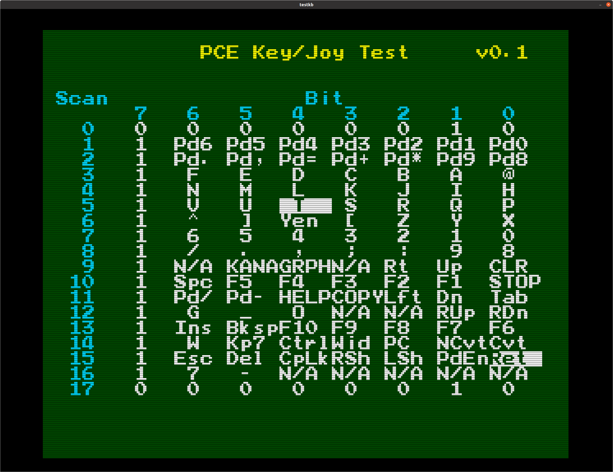

# Tsuushin Keyboard

The Unreleased PC Engine Keyboard

## Test ROM

I have written a short program in HuC which will properly scan the keyboard and display
when keys are pressed or released.

## Screen shot

## Program Code

The program source can be found in this repository in the Software/Test_ROM directory.
The RELEASE subdirectory conatins a pre-compiled executable.

## Build Process

As of the time of writing, this requires the most recent version of HuC (development
version as at March 25, 2024 - not even published in a proper release yet) in order
to build correctly.

The reason for this is because programs written for HuC automatically call the
embedded joypad reading routine at every Vertical Sync interval (1/60 second).
In truth, we don't want that older jopyad routine to be used at all, replacing it
with our own.  The HuC library needed a small modification in order to make this
possible.

A trivial shell script (build.sh) was included with the appropriate command-line options
to build the ROM.

## Theory of Operation

The joypad routine triggers a read sequence (as a normal joypad read sequence would),
but rather than reading up to 5 bytes of input, this continues to read 18 bytes in total.

The first byte, as per the protocol, is a 0x02 - this demonstrates that it could not be a
normal joypad, because all 4 direction arrows would be depressed (the upper 4 of the '0' bits).

The next 16 bytes contain the keypress information.  This is encoded in a similar way to
the original PC-88 keyboard data, exept that the most significant bit is always a '1' value,
and has no corresponding keys. Keys which are pressed are represented by '0' bit values, and
keys which are not pressed are represented as '1' bit values.

The 18th byte is also a 0x02, to indicate end of sequence.
